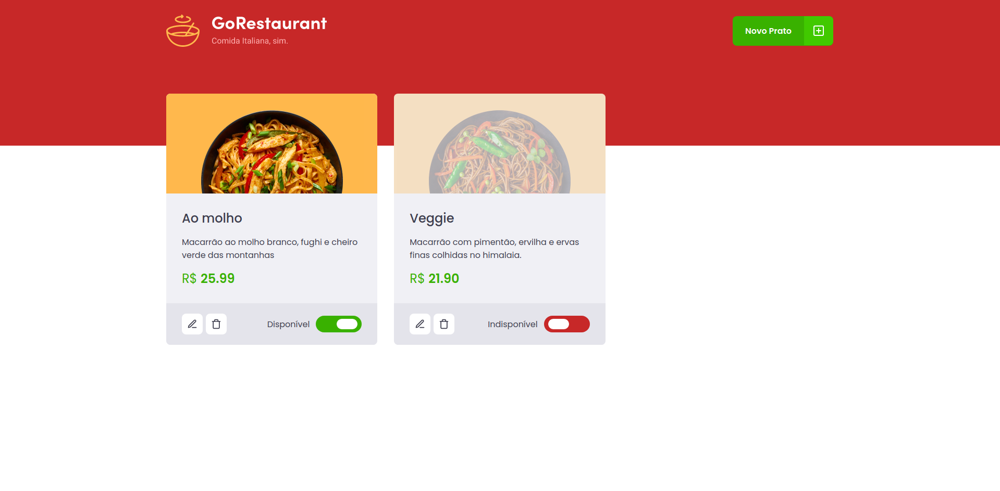

  
  
      

 

  

<h3 align="center">
  Desafio 04 - Trilha ReactJS
</h2>

	Resolução do Desafio "Refactoring de classes e Typescript"

## Sobre o desafio

  

Nesse desafio, você deverá criar uma aplicação para treinar o que aprendeu até agora no ReactJS

Essa será uma aplicação já funcional onde o seu principal objetivo é realizar dois processos de migração: de Javascript para Typescript e de Class Components para Function Components.

## Status do desafio

✅ Completo